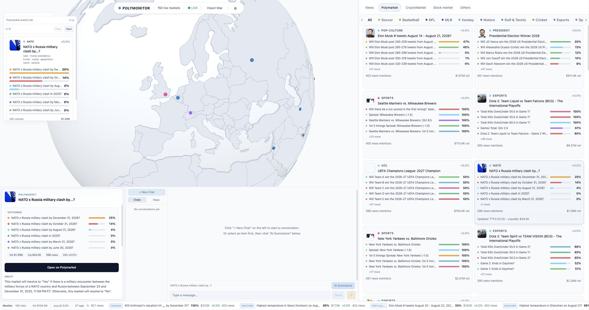
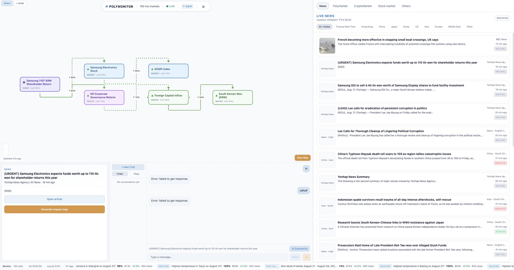
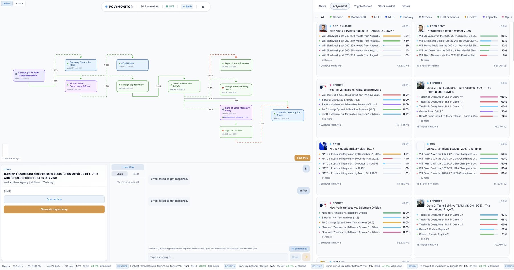
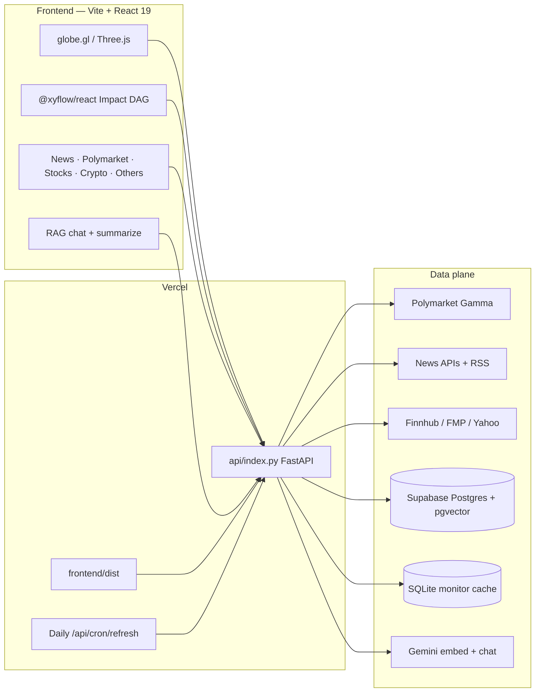

# PolyMonitor

**Event intelligence for prediction markets.** PolyMonitor turns Polymarket odds, global news, and cross-asset quotes into a single live workspace — a geographic heat map, a causal impact graph, and a Gemini-backed research assistant.

[](https://www.typescriptlang.org/)
[](https://www.python.org/)
[](https://react.dev/)
[](https://vite.dev/)
[](https://fastapi.tiangolo.com/)
[](https://tailwindcss.com/)
[](https://vercel.com/)

---

## Product walkthrough

### 1. Live globe + market tape

<p align="center">
  
</p>

The primary surface is a **cache-first monitoring desk**. A `globe.gl` / Three.js globe plots Polymarket events by inferred geography; marker color follows category, size follows `hot_score` (news mentions + 24h probability move + volume). Click a cluster to pin the event, inspect outcomes, and jump to Polymarket.

The right rail is a filterable **market card grid** (sports, politics, crypto, pop culture, …) with outcome bars, 24h volume, and infinite scroll against `GET /api/monitor/markets`. The bottom ticker streams the same live book — probabilities, volume, and mention counts — so the map never becomes a dead visualization.

### 2. Causal impact map + news desk

<p align="center">
  
</p>

Switch to **Impact Map** and the globe yields to a React Flow DAG. Nodes are typed (`event` / `market` / `macro` / `policy`) and color-coded; edges carry direction (`+` / `-` / uncertain). Gemini builds the chain from a selected headline, ticker, or Polymarket contract — then you can elaborate a node, save the map, and reload it from history.

The news column is a multi-source feed (GNews, WorldNewsAPI, NewsData, RTHK RSS) with region inference, breaking flags, and coarse sentiment. **Generate impact report** is the analyst loop: one article → a grounded causal graph → an AI brief instead of a wall of headlines.

### 3. Market drill-down + AI copilot

<p align="center">
  
</p>

Selection is a first-class object (`SelectedItem`: Polymarket / news / stock / crypto / other). The bottom-left detail pane shows rules, resolution source, and outcome bars. The bottom chat is not a generic chatbot — it is RAG over the item you just clicked:

- one-click `POST /api/rag/summarize` with Google Search grounding
- `POST /api/rag/chat` that retrieves Supabase `rag_documents`, then mixes in latest news, monitor markets, hot stocks, and commodities
- conversation history in `rag_conversations` / `rag_messages`

The right tabs (News · Polymarket · Crypto · Stocks · Others) all write into the same selection bus, so the map, the detail card, and the model stay in lockstep.

---

## What it is

PolyMonitor is a **decision-support dashboard** for people who trade or research event contracts. It answers three questions on one screen:

| Question | Surface |
| --- | --- |
| Where is attention concentrating? | Globe / 2D map + heat scoring |
| What else moves if this resolves? | Impact DAG (Gemini + React Flow) |
| Why should I believe that? | News + RAG chat with citations |

It is **not** an exchange. Execution stays on Polymarket; this repo is the monitoring, context, and causal layer on top.

---

## Tech stack

### Languages

| Layer | Language | Why |
| --- | --- | --- |
| SPA | **TypeScript 5.9** + TSX | Typed UI, Vite + `tsc -b` production build |
| API | **Python 3.9+** (3.12 in this environment) | FastAPI services, schedulers, embeddings |
| Data | **SQL** (Postgres + pgvector) | Supabase RAG tables / RPCs |
| Local cache | **SQLite** | Monitor markets so the UI is not blocked on cold start |
| Markup | **HTML + Tailwind CSS 4** | Utility-first layout, typography plugin |

### Frontend packages (`frontend/package.json`)

| Package | Role |
| --- | --- |
| `react` / `react-dom` **19** | App shell, panels, hooks |
| `vite` **8** + `@vitejs/plugin-react` | Dev server, HMR, production bundle |
| `tailwindcss` **4** + `@tailwindcss/vite` | Styling pipeline |
| `@tailwindcss/typography` | Markdown in the AI panel |
| `globe.gl` + `three` + `topojson-client` | 3D / 2D earth with country mesh and hotpoint markers |
| `@xyflow/react` + `dagre` | Impact-map graph + automatic LR layout |
| `lucide-react` | Icons |
| `react-markdown` + `remark-gfm` | Assistant replies |
| `clsx` + `tailwind-merge` | Conditional class names |
| `typescript` / `eslint` / `typescript-eslint` | Typecheck and lint |

Root workspace also uses `concurrently` to run frontend + backend together, and `@vnedyalk0v/react19-simple-maps` for React 19-compatible map primitives.

### Backend packages (`backend/requirements.txt`, `api/requirements.txt`)

| Package | Role |
| --- | --- |
| `fastapi` | REST + lifespan + (local) WebSocket |
| `uvicorn[standard]` | ASGI server |
| `pydantic` / `pydantic-settings` | Request models and `.env` config |
| `httpx` | Polymarket, news, Gemini, Supabase, Yahoo, Finnhub, FMP |
| `apscheduler` | Local refresh jobs (disabled on Vercel; cron used instead) |
| `websockets` | `/ws/hotpoints` broadcasts |
| `python-dotenv` | Local secrets |

Stdlib `sqlite3` persists `backend/data/monitor_markets.sqlite`. There is **no** separate vector database — embeddings live in Supabase.

### Platform & data plane

| Service | Use |
| --- | --- |
| **Vercel** | Vite static frontend + Python serverless (`api/index.py` → FastAPI) |
| **Supabase** | `news_cache`, `rag_documents` (pgvector 3072) + `match_rag_documents`, chat/impact-map tables |
| **Google Gemini** | `gemini-embedding-001` ingest; chat/summarize/impact with `gemini-3.5-flash-lite` and a 3.x/2.5 fallback chain |
| **Polymarket Gamma** | Events / markets (`https://gamma-api.polymarket.com`) |
| **News** | GNews, WorldNewsAPI, NewsData, RTHK RSS |
| **Markets** | Finnhub, Financial Modeling Prep, Massive, Yahoo Finance quotes |

---

## Architecture



**Cache-first, quota-aware.** Monitor markets are served from memory + SQLite; each `GET /api/monitor/markets` kicks a background refresh with a re-entry guard so the request never waits on Gamma. News has daily caps and optional schedulers. Gemini calls retry/backoff on 429 and fall back across chat models on Vercel.

Local long-running mode (`backend/app/main.py`) adds APScheduler + WebSocket. Serverless mode (`backend/app/main_serverless.py`) drops the in-process scheduler and uses Vercel Cron instead.

---

## Repository layout

```
PolyMonitor/
├── frontend/                 # Vite + React SPA
│   ├── src/App.tsx           # Shell: map split, tabs, selection, chat
│   ├── src/components/       # Globe, impact map, panels, ticker
│   ├── src/api/client.ts     # Typed fetch wrappers
│   └── src/hooks/            # Monitor + crypto streams
├── backend/                  # FastAPI application
│   ├── app/main.py           # Local: scheduler + /ws/hotpoints
│   ├── app/main_serverless.py
│   ├── app/core/config.py    # Settings / env
│   ├── app/api/routes/       # REST
│   └── app/services/         # Polymarket, news, RAG, graph, quotes
├── api/index.py              # Vercel Python entry (imports serverless app)
├── vercel.json               # Vite build + /api rewrite + cron
├── backend/supabase_rag.sql  # pgvector schema + match RPC
└── docs/screenshots/         # Product stills used above
```

---

## HTTP surface

| Method | Path | Purpose |
| --- | --- | --- |
| `GET` | `/api/health` | Liveness |
| `GET` | `/api/monitor/markets` | Hot points for map + list |
| `GET` | `/api/news` | `region`, `time_window`, `breaking_only`, pagination |
| `GET` | `/api/stocks/market`, `/api/stocks/hot` | Exchange sectors + hot large-caps |
| `GET` | `/api/others`, `/api/goods/hot` | FX / energy / metals / commodities |
| `POST` | `/api/rag/ingest` | Chunk → embed → upsert `rag_documents` |
| `POST` | `/api/rag/ask` | Retrieve + Gemini answer |
| `POST` | `/api/rag/chat` | Ask + persist conversation |
| `POST` | `/api/rag/summarize` | Grounded brief for a `SelectedItem` |
| `POST` | `/api/impact-map/generate` | Causal DAG from selection or chat |
| `POST` | `/api/impact-map/save` | Persist graph to Supabase |
| `POST` | `/api/cron/refresh` | Vercel Cron (Bearer `CRON_SECRET`) |
| `WS` | `/ws/hotpoints` | Local push of recomputed hotpoints |

---

## Run locally

**Prerequisites:** Node.js 18+, Python 3.9+, npm.

```bash
# from repo root — frontend :5173 and API :8001 together
npm install
cd frontend && npm install && cd ..
cd backend && python -m venv .venv
source .venv/bin/activate          # Windows: .venv\Scripts\activate
pip install -r requirements.txt
cd ..
npm run dev
```

- UI: [http://localhost:5173](http://localhost:5173)
- Health: [http://localhost:8001/api/health](http://localhost:8001/api/health)
- Vite proxies `/api` and `/ws` to `localhost:8001`

### `backend/.env`

```bash
DEBUG=true
CORS_ORIGINS=["*"]

SUPABASE_URL=
SUPABASE_SERVICE_ROLE_KEY=

GEMINI_API_KEY=
GEMINI_EMBEDDING_MODEL=gemini-embedding-001
GEMINI_CHAT_MODEL=gemini-3.5-flash-lite
GEMINI_CHAT_MODEL_FALLBACKS=gemini-3.5-flash,gemini-3.1-flash-lite,gemini-3.6-flash,gemini-2.5-flash-lite

NEWS_API_KEY=
NEWS_API_KEY2=
GNEWS_API_KEY=
WORLDNEWS_API_KEY=

FINNHUB_API_KEY=
FMP_API_KEY=

NEWS_SCHEDULER_ENABLED=false
NEWS_FETCH_EXTERNAL_ON_REQUEST=false
```

Missing news/market keys degrade gracefully (fewer articles, Yahoo-backed quotes where possible) instead of hard-500ing the UI.

Optional `frontend/.env`:

```bash
VITE_API_BASE_URL=
```

Leave empty in local dev so the Vite proxy is used. On Vercel the SPA and `/api` share the same origin.

---

## Deploy (Vercel)

`vercel.json` builds the Vite app (`frontend/dist`), routes `/api/*` to the Python serverless function, and runs a daily refresh cron.

1. Import the GitHub repo into Vercel (framework preset is already `vite`).
2. Set the same secrets as `backend/.env`, plus `CRON_SECRET` for `/api/cron/refresh`.
3. Production tracks **`main`**. Preview deployments are created for every branch / PR.

Gemini chat defaults to `gemini-3.5-flash-lite`, then `gemini-3.5-flash` / `gemini-3.1-flash-lite` / `gemini-3.6-flash`. A 404 or retired model skips immediately to the next ID; API keys are sent via `x-goog-api-key` and never echoed in UI errors.
